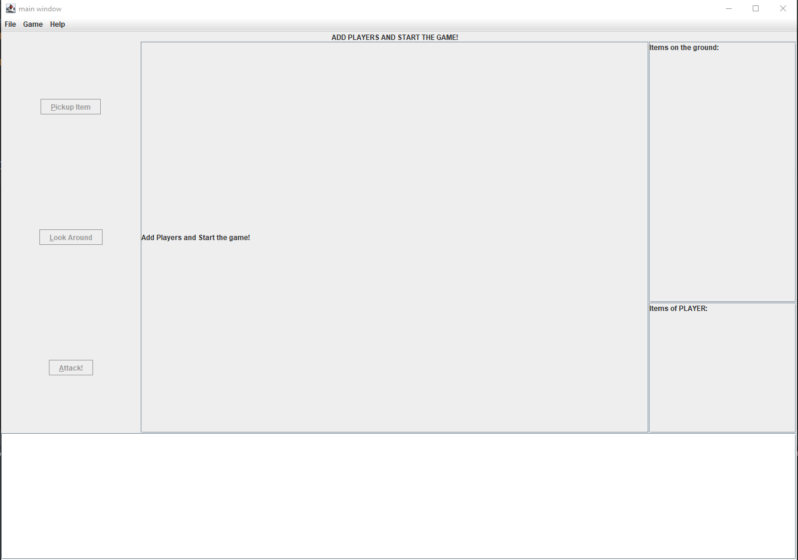
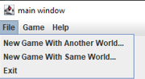
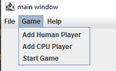
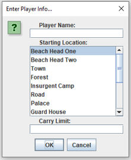
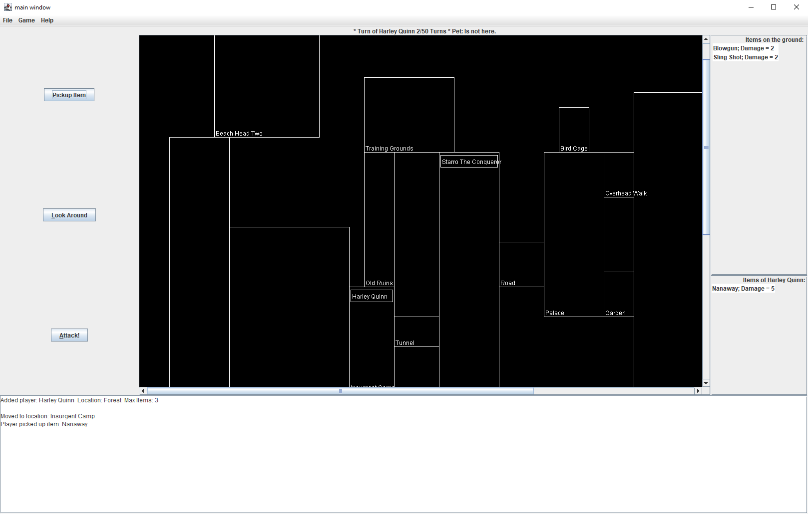
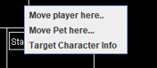

# CS 5010 Semester Project

This repo represents the coursework for CS 5010, the Fall 2022 Edition!

**Name:** Lillith Chute and Donglin Xu

**Email:** chute.l@northeastern.edu

**Preferred Name:** Lillith and Donglin

**Updated:** April 23, 2022

### About/Overview

This program is about the development of a world that will eventually become part of a game.  This world will be loosely based 
upon a game called Kill Doctor Lucky, which has several iterations.  The world is created using data in a specially formatted 
text file.  This file is loaded and processed by the game and displayed as a series of spaces that make up the 
world/board.  

In this world there is a target.  This target moves through the spaces one at a time in sequence.  
In addition to the target that moves through the spaces, there are items in this world.  
These items are located in the spaces.  Items are used to attack the target.  There is also a pet in the world.  
This pet is used to make what is inside a room invisible.  A space can have one or more items or none at all.  There are also players both 
human and computer that can interact in the world.  Any number of players can be added.  Players have six actions they can perform 
as listed in the features section.

This game was originally playable as a console game.  However, it now has a graphical front end implemented in Java 
Swing.

### List of Features

The game board consists of several areas.  There is the menu bar which has:
1. File - For loading a new world, replaying with the same world, exiting the game.
2. Game - Game operations related to adding players and starting the game.
3. Help - That's how you got here, silly!

At the center of the board is where the World map will be displayed containing all the various
rooms, players, and the target of your wrath.

To the left of the map, are three buttons related to actions the players can take on their turn.

To the right of the map are two panels.  The top panel displays the weaponry that is located in the
room of the current player.  Below that is a panel that displays the implements of destruction that
the current player is carrying around.

The area below the map contains a field that displays all the actions that have taken place during
the course of playing the game.  

File Menu Options:
1. **New Game With Another World** - This lets you select a world from wherever you are storing your world building files.  Any world you want to play other than the one you are playing.  You *could* also pick the one that you just played, but that would be a little weird, don't you think?
2. **New Game With Same World** - This just restarts the game using the same world map you just played.  You get to kill that enemy of yours all over again!  Huzzah!
3. **Exit** - Exits the game.

Game Menu Options:
1. **Add Human Player** - If you are a human and will be the one taking control of the death and destruction, you want to use this menu item.
2. **Add CPU Player** - If you want a challenge, you can add a computer player to play against.  The computer will automatically take actions and try to kill the target before you do.
3. **Start Game** - Once you have added all the players, hit the start button, and you are on your way!

Finally, we have the **Help** which bring up the Help Menu.  Also,
click on the **About..** to find out who the **brilliant minds** are behind this incredible game!

Once the game is going, these are the additional features that the interface provides:

Buttons on the Left side:
1. **Pickup Item** - To take this action you first click on an item from the *Items on the ground* pane and then click the button and the item will be added to your inventory as long as you haven't reached your limit.  Remember that limit I told you about when adding a player?  Yeah, that's the one.
2. **Look around** - Clicking this button will print a very detailed description to the bottom text pane describing your room, the items in it, if the target is there, if the pet is there, if other players are there and will provide that same information about all the rooms that are neighbors to your current location.  The only caveat to that is if the *Pet* is in a neighboring space.  If that is the case you can't see into that space.
3. **Attack** - To take this action you first select a weapon from your inventory and then click the button.  If you have no items in your inventory, clicking the button will make you poke the target in the eye.  There are rules about successfully attacking a target.
    1. The target must be in the same room
    2. The attacking player cannot be seen by another player.  This means:
        1. Another player is not in the same space
        2. Another player is not in a neighboring space

Context Menu when the player Right Clicks:
This menu has three more actions that a player can take during their turn

1. **Move Player Here** - Clicking anywhere on the map will bring up this particular context menu item.  So long as the room you are clicking on is a neighboring space, you can move there.  If not, too bad.  We haven't developed teleportation yet!
2. **Move Pet Here** - Yes!  Now you get to find out about this Pet thing.  The Pet is a special character that makes a room's content completely invisible except to the player(s) in the room with the Pet.  Further, the Pet clearly can teleport, because the Pet can go from any room to any room.  Selecting this menu item will move the Pet from the room it is in to the room you selected making the contents of that room invisible, including you if you are in it.  They can't see you!  If the target is there, kill away!
3. **Target Character Info** - This menu item only displays if you click on a player's name and only if it is that player's turn.  This menu item describes the player, where the player is, all the items that the player is carrying and prints it to the text area at the bottom of the game board.

### How to Run
**********PLACEHOLDER*************
The JAR file is called MileStone3.jar.  The only parameter it requires is a fully qualified path and filename for the properly formatted world building file.
An example usage using windows would be to open a command window.  Navigate to the directory
containing the jar file.  Use the following command:

java -jar MileStone3.jar {filename of world building file}

i.e. for me using the Suicide Squad world:

java -jar MileStone3.jar CortoMaltese.txt

### How to Use the Program

# Reverse Clue A.K.A. The Best Game You Have Ever Played

Congratulations on deciding to be a super cool gamer and electing to find out what it feels like to be on the other side of
the game of Clue.  Instead of trying to figure out who the killer is, you get to BE the killer!  On
your journey to committing homicide, remember to have fun and be creative!

This help menu will guide you on your journey to understanding the game elements and the controls you
will need to destroy the target of your choice.  If you don't feel a sense of relief at the conclusion
of absolutely annihilating your opponent, you have done it wrong.

# Game Board Basic Layout A.K.A. The Designer is Genius!

The game board consists of several areas.  There is the menu bar which has:
1. File - For loading a new world, replaying with the same world, exiting the game.
2. Game - Game operations related to adding players and starting the game.
3. Help - That's how you got here, silly!

At the center of the board is where the World map will be displayed containing all the various
rooms, players, and the target of your wrath.

To the left of the map, are three buttons related to actions the players can take on their turn.

To the right of the map are two panels.  The top panel displays the weaponry that is located in the
room of the current player.  Below that is a panel that displays the implements of destruction that
the current player is carrying around.

The area below the map contains a field that displays all the actions that have taken place during
the course of playing the game.  Think of it as a diabolical diary of your plan of death!

# Menu Items A.K.A. Boring Stuff You Need To Know

So, you are wondering what these little bad boy menu items are for and how they can help me kill my
least favorite target?  Well, here we go..

1. **New Game With Another World** - This lets you select a world from wherever you are storing your world building files.  Any world you want to play other than the one you are playing.  You *could* also pick the one that you just played, but that would be a little weird, don't you think?
2. **New Game With Same World** - This just restarts the game using the same world map you just played.  You get to kill that enemy of yours all over again!  Huzzah!
3. **Exit** - Duh.

This menu is key to getting your ultimate revenge plot off the ground.  You must start here.  Before you can
work out your frustrations, you need to add players to the game.  So, add yourself!  Add your friends!  Have a party!!!!

1. **Add Human Player** - If you are a human and will be the one taking control of the death and destruction, you want to use this menu item.
2. **Add CPU Player** - If you want a challenge, you can add a computer player to play against.  The computer will automatically take actions and try to kill the target before you do.
3. **Start Game** - Once you have added all the players, hit the start button, and you are on your way!

Finally, we have the **Help**.  If you are reading this, you have already been there and know what you are doing.  Also,
click on the **About..** to find out who the **brilliant minds** are behind this incredible game!

# Adding Players A.K.A. Pick Me!  Pick Me!

When you are ready to play, the first thing you want to do is add players to the game.  Go to the **Game** menu item and select either
Add Human or Add CPU.  You will be presented with the following menu:

When you decide to add either a computer or human player, you are presented with the same dialog box.  There
are three pieces of information you need to provide to create a player.  You need a name, obviously.  Second, you need
to pick a starting location on the map.  The list are all the possible locations where you can begin.  Throw a dart!  Finally,
the last piece of information is the maximum number of dangerous weapons that you can carry.  For a challenge, choose a small number.  You can also go
really big so you can scarf up everything on the map! Who says you can't carry 324,567 weapons?

# Starting the Game A.K.A. About Time

Once you have finished adding players, click on **Start Game** within the **Game** menu to begin.

After, you will be prompted for the maximum number of turns that the game will have.  Put in any number!  Make the
game short, make it long, have so many turns you will grow wrinkles!  After you tell it how many turns there will be,
the game begins!

# Playing the Game A.K.A. Game Features

So, here we have a game in progress.  In the middle is the world the players are inhabiting.  If you
look on the board, you will see a player named *Harley Quinn*.  That's me!  Your narrator!  You will also
see *Starro The Conqueror*.  He's a big bad starfish causing all sorts of problems.  That's my target.

To the left you will see the **Items on the Ground** pane.  These are the items in the room that I am
occupying that I can pick up to add to my inventory.  Right below that is the **Items of Harley Quinn**.  There
are the weapons I am currently carrying around.

At the bottom of the screen is all the stuff that has happened since I started trying to kill Starro.

At the top, right above the map is a thin little bar that lets you, the player, know whose turn it currently is, how many
turns have been taken out of the maximum, and whether the Target's pet is in the room with you.  Pet?  What Pet, you ask?  
We will get to that shortly.

### Buttons A.K.A. Push Them All!

1. **Pickup Item** - To take this action you first click on an item from the *Items on the ground* pane and then click the button and the item will be added to your inventory as long as you haven't reached your limit.  Remember that limit I told you about when adding a player?  Yeah, that's the one.
2. **Look around** - Clicking this button will print a very detailed description to the bottom text pane describing your room, the items in it, if the target is there, if the pet is there, if other players are there and will provide that same information about all the rooms that are neighbors to your current location.  The only caveat to that is if the *Pet* is in a neighboring space.  If that is the case you can't see into that space.
3. **Attack** - To take this action you first select a weapon from your inventory and then click the button.  If you have no items in your inventory, clicking the button will make you poke the target in the eye.  There are rules about successfully attacking a target.
    1. The target must be in the same room
    2. The attacking player cannot be seen by another player.  This means:
        1. Another player is not in the same space
        2. Another player is not in a neighboring space

### Context menu A.K.A. More Boring Stuff

The context menu is displayed when you right-click on a player or on a room in the map.  This menu has three more
actions that a player can take during their turn

1. **Move Player Here** - Clicking anywhere on the map will bring up this particular context menu item.  So long as the room you are clicking on is a neighboring space, you can move there.  If not, too bad.  We haven't developed teleportation yet!
2. **Move Pet Here** - Yes!  Now you get to find out about this Pet thing.  The Pet is a special character that makes a room's content completely invisible except to the player(s) in the room with the Pet.  Further, the Pet clearly can teleport, because the Pet can go from any room to any room.  Selecting this menu item will move the Pet from the room it is in to the room you selected making the contents of that room invisible, including you if you are in it.  They can't see you!  If the target is there, kill away!
3. **Target Character Info** - This menu item only displays if you click on a player's name and only if it is that player's turn.  This menu item describes the player, where the player is, all the items that the player is carrying and prints it to the text area at the bottom of the game board.

# Winning the Game A.K.A. I am Awesome

Well, you made it this far, so you must be really into this or completely bored out of your mind.  Anyway, the game
will end one of two ways.  Either your master plan of causing permanent bodily harm to your target came to fruition, and you
were the one that killed the target, in which case, congratulations!  You won the game!  Alternatively, the maximum number of turns
was reached and the target is still alive.  In this case, boo!  The target got away, and you will have to come up with a new master
death plan and try again another day.

Best of luck to you, my death dealers!

### Example Runs
There are no example runs required for this milestone.  Instead, there will be a video demonstration 
of the game and that will be uploaded via Canvas.

### Design/Model Changes

A lot of these changes will be written about in broad terms.  THere were so many changes that to describe each
one in granular terms might take as long to write as it was to write the application.

1. Redesigned the way that the Player is represented:
   1. The Player and computer player was distinguished through the use of a boolean flag in Milestone 3.
   2. The player has be redesigned to by polymorphic
      1. The player has an interface
      2. The BasePlayer class holds all the common actions
      3. The human player extends the BasePlayer class and actions specific to humans resides there
      4. The computer player class has the random functionality implemented there.
2. Significant modifications were made to the World class as a lot of the computer player management was done in that class and all of it was moved to the Computer Player class. 
3. Removed the console game controller and other associated console related pieces.
4. Updated functionality in the Command Pattern to better interact with the View
5. Updated the computer player so picking up items when it's inventory is full interacts better with the View.
6. Made significant code changes to make the rendering of the image for the game board look since and be properly rendered and aligned.
   1. Also made a lot of changes in that same piece of code to place the player name plates inside the rooms they are located in.
7. Wrote a Utility class to hold a few common re-usable methods.
8. Created ViewModels interfaces for all the models to provide read-only access to the controller to create further separation of concerns and safety.  
9. And the big change: Built a View and Controller for the Game Model
   1. Created a Controller Features interface which lists all the behaviors/actions that the View needs to be able to provide
   2. Created a UiController interface representing public methods that are unique to the controller, but not part of the features used by the view.
   3. Created a Graphical Controller implementing the above interfaces and providing communication between the View and the Model
   4. Created an interface for the View that has public methods for things like the Welcome screen, error prompting and so on.
   5. Created a Main form that implements that Interface and builds the actual GUI out of Java Swing components and implements the listeners needed for the user to interact with the game.
   6. Created a Driver class to start up the program. 

### Assumptions

1. There can be only one Target during the course of the game.
2. Target's name does not change.
3. Target moves with each action that is a 'turn'.
   1. Target moves in order of the index of the spaces starting with 0.
4. Items are set in their locations at the beginning of the game.
5. Item's name and damage do not change.
6. Items can now be picked up by a player and move with them
7. Space's names and attributes cannot change.
8. There can be more than one space with the same name.  In my world there can be multiple guard houses.
9. There can be unlimited number of players.
10. Players are added at the beginning of the game and after the game begins no players can be added.
11. Players and items:
    1. Players can pick up items in the space they are in.
    2. If an item has been picked up by another player, that item will not be visible and cannot be picked up
    3. Once a player picks up an item they can't drop it.
    4. Players have a max limit of items they can carry and can't carry more than that.
12. Players and spaces
    1. Players can move but only to adjoining spaces.  
13. Pet makes the contents of a room invisible but not the room itself.  Thus, a player knows that room might be a neighbor but nothing else about it.
14. If a player uses an item as an attack it is removed from game play.  This will free up an inventory slot.
15. The pet only moves when a player moves it.
16. Computer player can do all the same actions as a human player
17. The computer player will ALWAYS choose to attack if they cannot be seen.  They will also ALWAYS choose the item with the highest damage.

### Limitations

1. The way that the program computes neighboring spaces is checking for intersecting lines.  This leads to some difficulty in figuring out how to tell if spaces overlap when loading the world building file.  So, currently the application assumes that the buildings will not overlap.
2. DFS search for Pet movement is not implemented for this game.

### Citations

Not applicable.

