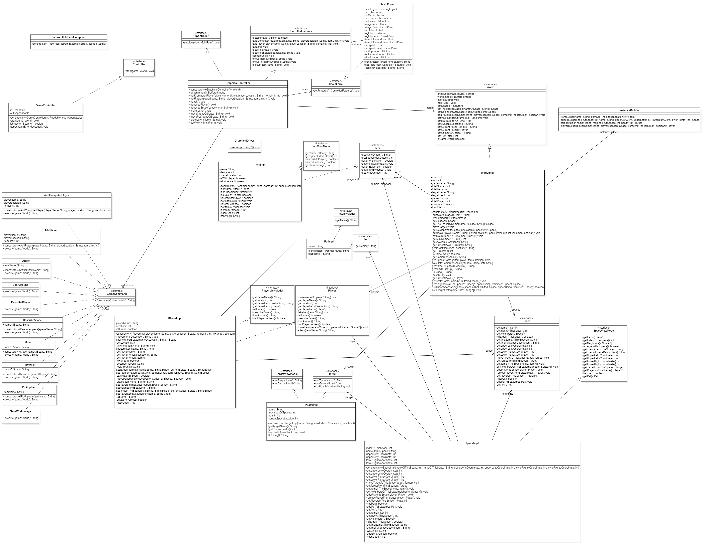
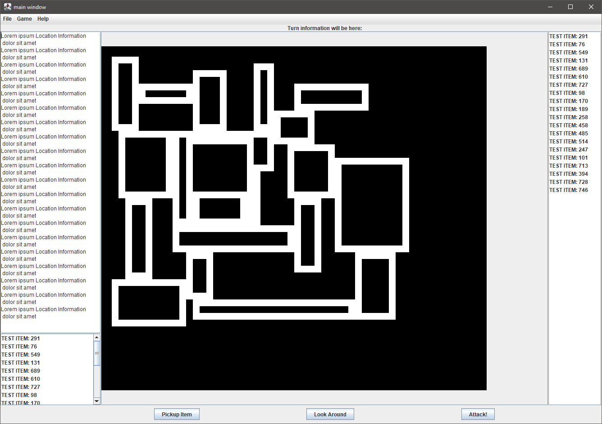
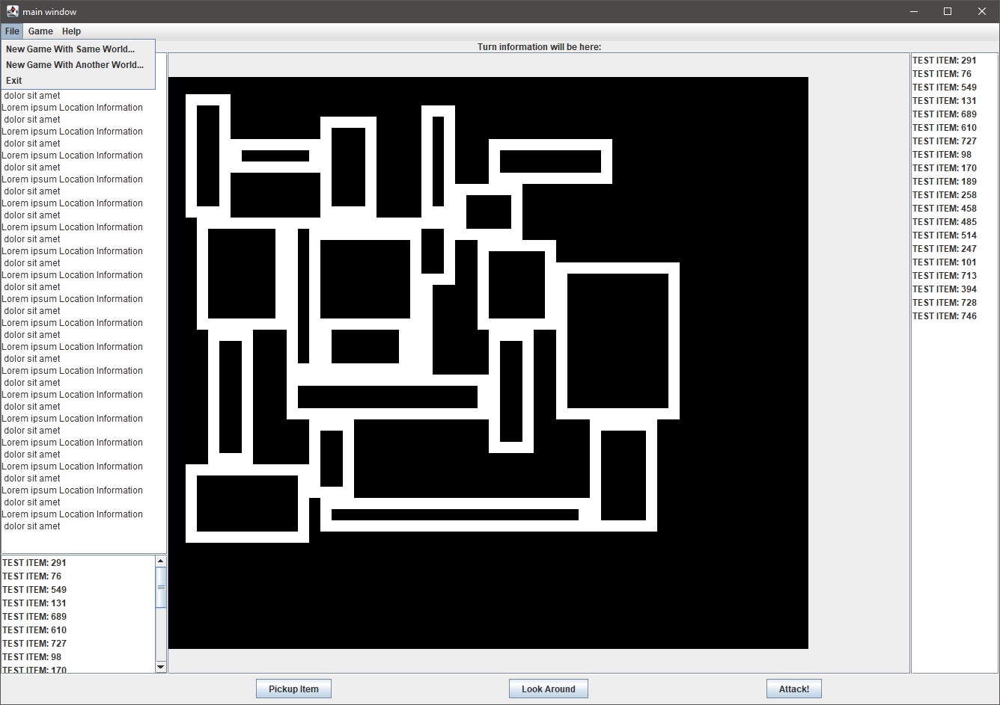
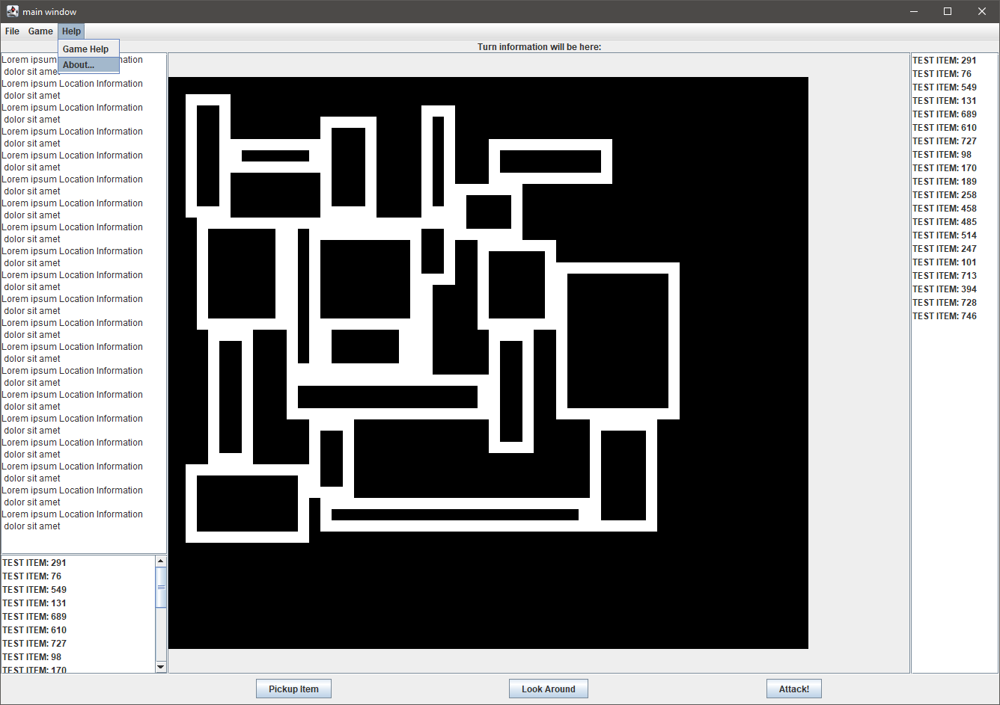

# Milestone 4 Additional Docuemnts

# UML

# UI Sketch

# Design Changes

Instead of the text-based controller, a new graphical controller is added to replace the ones found in previous milestones. This new controller strictly follows a traditional MVC pattern, which facilitates the communication between the view and the model. More specifically, all user actions in the view will be forwarded into the controller (which itself only exposes an features interface). The controller manipulates the model for the game logic, and then pushes model changes back to update the view.

Some model methods will be refractored, such as `WorldImpl.printWorldImageToDisk()`. Instead of performing I/O operations or internal state mutations, these methods will now return raw output back to the controller. The controller will process these data and push the corresponding changes to update the view.

In order to further decouple the model, the controller and the view, all model classes will now have a corresponding `ViewModel` interface (such as `ItemImpl` and `ItemViewModel`). These new interfaces allows read operations but restricts write operations, so that no data can be mutated when obtained elsewhere in a view or a controller.

# Additional Controller Testing

| Testing GraphicalController with mock model and mock view | Input                                    | Expected                                                        |
| --------------------------------------------------------- | ---------------------------------------- | --------------------------------------------------------------- |
| Constructor (invalid)                                     | Valid world object                       | No exception thrown                                             |
| Constructor (valid)                                       | null                                     | IllegalArgumentException                                        |
| obtainImage                                               | N/A                                      | valid BufferedImage                                             |
| addComputerPlayer (invalid)                               | null playerName, valid playerLocation    | IllegalArgumentException                                        |
| addComputerPlayer (invalid)                               | valid playerName, invalid playerLocation | IllegalArgumentException                                        |
| addComputerPlayer (valid)                                 | valid playerName, valid playerLocation   | Mock model receives method call, mock view receives method call |
| addPlayer (invalid)                                       | null playerName, valid playerLocation    | IllegalArgumentException                                        |
| addPlayer (invalid)                                       | valid playerName, invalid playerLocation | IllegalArgumentException                                        |
| addPlayer (invalid)                                       | valid playerName, valid playerLocation   | Mock model receives method call, mock view receives method call |
| attack                                                    | N/A                                      | Mock model receives method call, mock view receives method call |
| describePlayer                                            | N/A                                      | Mock model receives method call, mock view receives method call |
| lookaround                                                | N/A                                      | Mock model receives method call, mock view receives method call |
| move (invalid)                                            | null                                     | IllegalArgumentException                                        |
| move (valid)                                              | valid playerName                         | Mock model receives method call, mock view receives method call |
| movePet (invalid)                                         | null                                     | IllegalArgumentException                                        |
| movePet (valid)                                           | valid nameOfSpace                        | Mock model receives method call, mock view receives method call |
| pickup (invalid)                                          | null                                     | IllegalArgumentException                                        |
| pickup (valid)                                            | valid itemName                           | Mock model receives method call, mock view receives method call |
| setView (invalid)                                         | null                                     | IllegalArgumentException                                        |
| setView (valid)                                           | valid MainForm object                    | mock view receives method call                                  |

