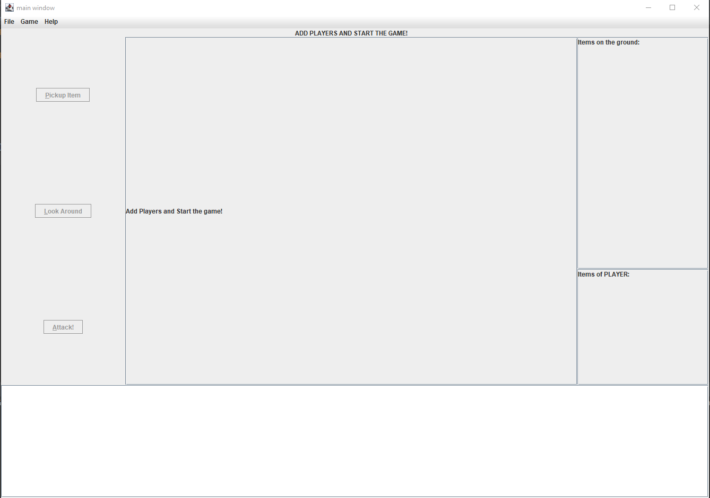
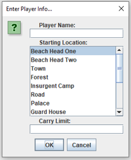
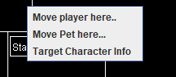

# Reverse Clue

Congratulations on deciding to be a super cool gamer and electing to find out what it feels like to be on the other side of 
the game of Clue.  Instead of trying to figure out who the killer is, you get to BE the killer!  On 
your journey to committing homicide, remember to have fun and be creative!

This help menu will guide you on your journey to understanding the game elements and the controls you 
will need to destroy the target of your choice.  If you don't feel a sense of relief at the conclusion 
of absolutely annihilating your opponent, you have done it wrong.

# Game Board Basic Layout.

The game board consists of several areas.  There is the menu bar which has: 
1. File - For loading a new world, replaying with the same world, exiting the game.
2. Game - Game operations related to adding players and starting the game.
3. Help - That's how you got here, silly!

At the center of the board is where the World map will be displayed containing all the various 
rooms, players, and the target of your wrath.

To the left of the map, are three buttons related to actions the players can take on their turn.

To the right of the map are two panels.  The top panel displays the weaponry that is located in the 
room of the current player.  Below that is a panel that displays the implements of destruction that 
the current player is carrying around.

The area below the map contains a field that displays all the actions that have taken place during 
the course of playing the game.  Think of it as a diabolical diary of your plan of death!

# Menu Items

So, you are wondering what these little bad boy menu items are for and how they can help me kill my 
least favorite target?  Well, here we go..

1. **New Game With Another World** - This lets you select from wherever you are storing your world building files, any world to play than the one you are playing.  You *could* also pick the one that you just played, but that would be a little weird, don't you think?
2. **New Game With Same World** - THis just restarts the game using the same world map you just played.  You get to kill that enemy of yours all over again!  Huzzah!
3. **Exit** - Duh.

This menu is key to getting your ultimate revenge plot off the ground.  You must start here.  Before you can 
work out your frustrations, you need to add players to the game.  So, add yourself!  Add your friends!  Have a party!!!!

1. **Add human player** - If you are a human and will be the one taking control of the death and destruction, you want to use this menu item.
2. **Add CPU Player** - If you want a challenge, you can add a computer player to play against.  The computer will automatically take actions and try to kill the target before you do.
3. **Start Game** - Once you have added all the players, hit the start button, and you are on your way!

Finally, we have the **Help**.  If you are reading this, you have already been there and know what you are doing.  Also, 
click on the **About..** to find out who the **brilliant minds** are behind this incredible game! 

# Adding Players

When you are ready to play, the first thing you want to do is add players to the game.  Go to the **Game** menu item and select either 
Add Human or Add CPU.  YOu will be presented with the following menu:

When you decide to add either a computer or human player, you are presented with the same dialog box.  THere 
are three pieces of information you need to provide to create a player.  You need a name, obviously.  Second, you need 
to pick a starting location on the map.  THe list are all the possible locations where you can begin.  Throw a dart!  Finally, 
the last piece of information is the maximum number of dangerous weapons that you can carry.  For a challenge, choose a small number.  You can also go 
really big so you can scarf up everything on the map! Who says you can't carry 324,567 weapons? 

# Starting the Game

Once you have finished adding players, click on **Start Game** within the *Game* menu to begin.  
After, you will be prompted for the maximum number of turns that the game will have.  Put in any number!  Make the 
game short, make it long, have so many turns you will grow wrinkles!  After you tell it how many turns there will be, 
the game begins!

# Playing the Game A.K.A. Game Features

So, here we have a game in progress.  In the middle is the world the players are inhabiting.  If you 
look on the board, you will see a player named *Harley Quinn*.  That's me!  Your narrator!.  You will also 
see *Starro The Conqueror*.  He's a big bad starfish causing all sorts of problems.  That's my target.

To the left you will see the **Items on the Ground** pane.  These are the items in the room that I am 
occupying that I can pick up to add to my inventory.  Right below that is the **Items of Harley Quinn**.  There 
are the weapons I am currently carrying around.

At the bottom of the screen is all the stuff that has happened since I started trying to kill Starro.

At the top, right above the map is a think little par that lets you, the player, know whose turn it currently is, how many 
turns have been taken out of the maximum, and whether the Target's pet is in the room with you.

### Buttons

1. **Pickup Item** - To take this action you first click on an item from the *Items on the ground* pane and then click the button and the item will be added to your inventory as long as you haven't reached your limit.
2. **Look around** - Clicking this button will print a very detailed description to the bottom text pain describing your room, the items in it, if the target is there, if the pet is there, if other players are there and will provide that same information about all the rooms that are neighbors to your current location.  THe only caveat to that is if the *Pet* is in a neighboring space.  If that is the case you can't see into that space.
3. **Attack** - To take this action you first select a weapon from your inventory and then click the button.  If you have no items in your inventory, clicking the button will make you poke the target in the eye.  There are rules about successfully attacking a target.
   1. The target must be in the same room
   2. The attacking player cannot be seen by another player.  This means:
       1. Another player is not in the same space
       2. Another player is not in a neighboring space

### Context menu

The context menu is displayed when you right-click on a player or on a room in the map.  This menu as three more 
actions that a player can take during their turn

1. **Move Player Here** - Clicking anywhere on the map will bring up this particular context menu item.  So long as the room you are clicking on is a neighboring space, you can move there.  If not, too bad.  We haven't developed teleportation yet!
2. **Move Pet Here** - The Pet is a special character that makes a room's content completely invisible except to the player in the room with the Pet.  Further, the Pet, clearly can teleport, because the Pet can go from any room to any room.  Selecting this menu item will move the Pet from the room it is in to the room you selected.
3. **Target Character Info** - This menu item only displays if you click on a player's name and only if it is that player's turn.  This menu item describes the player, where the player is, all the items that the player is carrying and prints it to the text area at the bottom of the game board.

# Winning the Game A.K.A. I am Awesome

Well, you made it this far, so you must be really into this or completely bored out of your mind.  Anyway, the game 
will end one of two ways.  Either your master plan of causing permanent bodily harm to your target came to fruition, and you 
were the one that killed the target, in which case, congratulations!  You won the game!  Alternatively, the maximum number of turns 
was reached and the target is still alive.  In this case, boo!  The target got away, and you will have to come up with a new master 
death plan and try again another day.

Best of luck to you, my death dealers!